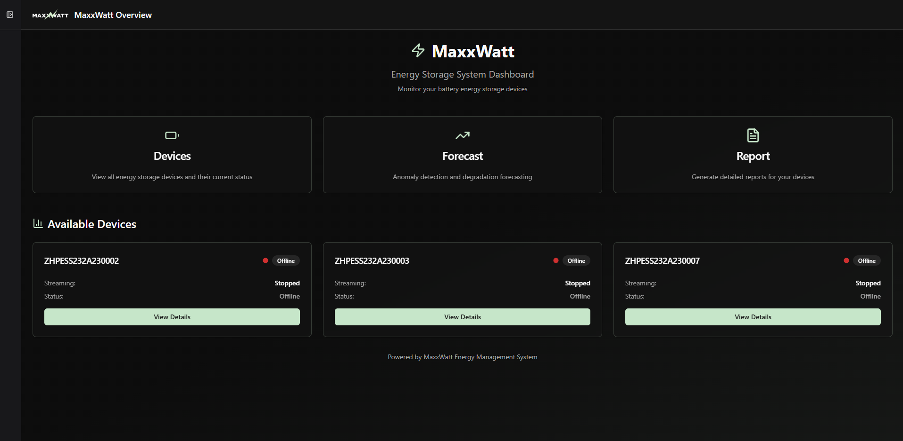
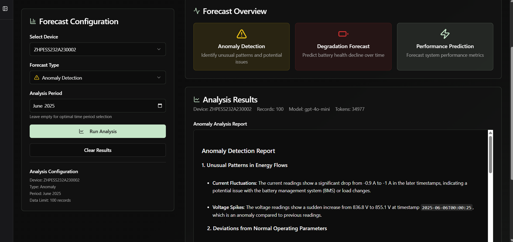
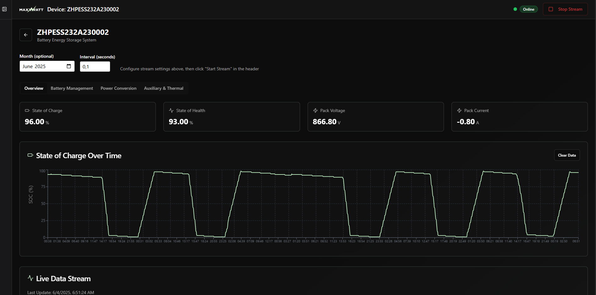
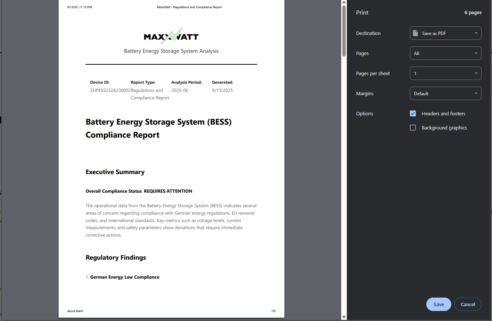

# MaxxWatt Energy Management Platform

**Berlin Energy Hackathon 2025** submission - An intelligent Battery Energy Storage System (BESS) monitoring and management platform with real-time analytics, anomaly detection, and energy forecasting capabilities.

## 🎥 Demo Video

[](https://www.loom.com/share/cc96c4b830e947ff919d3910525a2384?sid=8c8c50da-bc06-47db-bb79-8650f1cb143f)

## 🏆 Team

- **Sebastian Russo** - [GitHub](https://github.com/Rouxxel/)
- **Javier Peres** - [GitHub](https://github.com/peres84)

## 📸 Screenshots

### Dashboard Homepage



### Anomaly Forecasting Detection



### Analytics & Monitoring



### PDF Report Generation



## 🚀 Project Overview

MaxxWatt is a comprehensive energy management platform that combines:

- Real-time BESS data monitoring
- AI-powered anomaly detection
- Energy consumption forecasting
- Automated compliance reporting
- Interactive data visualization

## 🏗️ Architecture

The platform consists of two main components:

### 🔌 API Backend (`/api`)

FastAPI-based REST API providing:

- Real-time streaming of BMS and PCS data
- Historical data analysis
- Anomaly detection algorithms
- Energy forecasting models

### 📊 Dashboard Frontend (`/dashboard`)

React-based web application featuring:

- Real-time monitoring interface
- Interactive charts and graphs
- Anomaly alerts and notifications
- PDF report generation

## ⚡ Quick Start

### Prerequisites

- Python 3.8+
- Node.js 16+
- npm or bun

### 1. Start the API Server

```bash
cd api
pip install -r requirements.txt
python main.py
```

API will be available at `http://localhost:8002`

### 2. Start the Dashboard

```bash
cd dashboard
npm install
npm run dev
```

Dashboard will be available at `http://localhost:5173`

## 📋 Features

- **Real-time Data Streaming** - Live BMS and PCS data visualization
- **Anomaly Detection** - AI-powered system health monitoring
- **Energy Forecasting** - Predictive analytics for energy planning
- **Compliance Reporting** - Automated PDF generation for regulations
- **Interactive Analytics** - Dynamic charts and performance metrics
- **Multi-device Support** - Responsive design for all screen sizes

## 🔧 Technology Stack

**Backend:**

- FastAPI
- Python
- Pandas
- Server-Sent Events (SSE)

**Frontend:**

- React
- TypeScript
- Vite
- shadcn-ui
- Tailwind CSS

## 📁 Project Structure

```
├── api/              # FastAPI backend
│   ├── main.py       # API entry point
│   ├── routers/      # API endpoints
│   ├── models/       # Data models
│   └── utils/        # Utility functions
├── dashboard/        # React frontend
│   ├── src/          # Source code
│   └── public/       # Static assets
├── images/           # Screenshots and assets
└── docs/            # Documentation
```

## 🏅 Hackathon Highlights

This project was developed for the Berlin Energy Hackathon 2025, focusing on innovative solutions for energy management and sustainability. Key achievements:

- Real-time processing of large BESS datasets (6GB+)
- Advanced anomaly detection algorithms
- Intuitive user interface for energy professionals
- Scalable architecture for enterprise deployment

---

_🌱 Building the future of sustainable energy management_